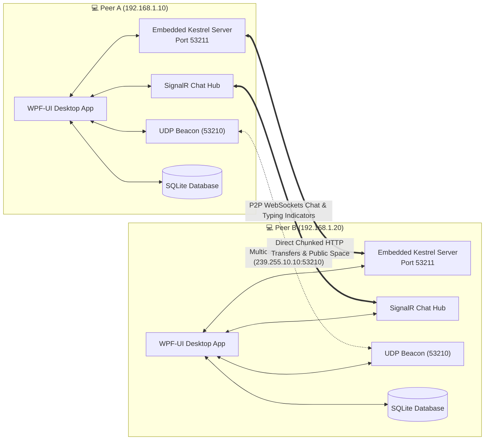

<div align="center">

# 🌐 LocalShare

**Decentralized LAN-Only P2P File Sharing, Real-Time Chat & Public Space for Windows**

[](https://dotnet.microsoft.com/download/dotnet/10.0)
[-0078D6?logo=windows&logoColor=white)](https://www.microsoft.com/windows)
[](https://github.com/lepoco/wpfui)
[-success)](#-system-architecture)
[](LICENSE)
[](https://github.com/razorisuru/LocalShare/releases)

<p align="center">
  <a href="#-key-features">Key Features</a> •
  <a href="#-system-architecture">Architecture</a> •
  <a href="#-quick-start--installation">Quick Start</a> •
  <a href="#-developer-guide">Developer Guide</a> •
  <a href="#-automated-build--releases">Build & Release</a> •
  <a href="#-storage-layout">Storage</a> •
  <a href="#-network-configuration">Networking</a>
</p>

---

</div>

## 📖 Overview

**LocalShare** is a zero-configuration, decentralized peer-to-peer desktop application for Windows built with **.NET 10**, **WPF-UI (Fluent Design)**, and **ASP.NET Core Kestrel**. 

It enables seamless, ultra-fast file transfers, real-time messaging, and shared folder browsing across local area networks (LAN)**100% offline, without internet access, third-party cloud servers, accounts, or configuration**. Every computer running LocalShare acts as an autonomous node that discovers other peers on the network in real time.

---

## 🚀 Key Features

### ⚡ 1. Zero-Configuration LAN Discovery
- Automatic background discovery of peers on the local subnet using **UDP multicast announcements** on `239.255.10.10:53210`.
- Real-time peer presence tracking with automatic online/idle/offline status updates.
- **Manual IP Addition**: Connect across different subnets or complex network topologies by adding target IP addresses directly.

### 📦 2. High-Speed Direct P2P File Transfers
- High-throughput chunked HTTP transfers streamed directly between peers using self-hosted **Kestrel** endpoints.
- **SHA-256 Checksum Verification** ensures end-to-end data integrity for every transferred file.
- Real-time transfer dashboard with live progress percentages, transfer speed (MB/s), elapsed time, and ETA.
- **Smart Directory Organization**: Incoming files are automatically organized neatly by the sender's display name (`%LOCALAPPDATA%\LocalShare\Received\<SenderDisplayName>\`).

### 💬 3. Real-Time 1:1 LAN Chat
- Low-latency chat powered by embedded **SignalR WebSockets** (`/hub/chat`).
- Real-time **typing indicators**, message delivery status, and persistent SQLite conversation history.
- **Inline Image & File Previews**: Send files directly inside chat conversations with visual bubble previews.

### 📋 4. Clipboard Screenshot Sharing & Drag-and-Drop
- **Instant Clipboard Paste (`Ctrl+V`)**: Paste captured screenshots or image data straight into the chat box.
- Seamless **drag-and-drop** file staging into chat conversations or directly onto peer cards.

### 📂 5. Public Space Folder Sharing
- Designate any local folder as your **Public Space** with a single click.
- Exposes selected files read-only across the LAN over HTTP.
- Other peers can browse folder hierarchies, search files, and download with **HTTP `Range` header support** for pause and resume.

### 👥 6. Mesh Group Management & Fan-Out Chat
- Create custom local groups without a centralized coordination server.
- Built-in **fan-out broadcast engine** automatically relays group messages to all active online group members.

### 🎨 7. Modern Windows 11 Fluent UI
- Crafted with **WPF-UI**, featuring Windows 11 Mica backdrop material, smooth acrylic styling, and responsive layout breakpoints.
- Dynamic **Light and Dark theme switching** with tailored contrast palettes.
- Profile customization: Display name, customizable avatar badges, and personalized accent colors.

### 🔔 8. Native Toast Notifications
- Custom non-intrusive desktop toast notifications for incoming file transfers, chat messages, and peer presence events.

### 🔄 9. In-App GitHub Auto-Updater
- One-click update check against GitHub releases with built-in markdown changelog viewer.
- Silent background download and automated restart using custom Inno Setup installer packaging.

---

## 🏛️ System Architecture

Every instance of **LocalShare** is a fully autonomous peer. There is no central server or coordinator node.



---

## 📂 Solution Structure

```
LocalShare.slnx
├── src/
│   ├── LocalShare.App/           # WPF Desktop UI (WPF-UI, MVVM, Views, ViewModels, Themes, Toast Notifications)
│   ├── LocalShare.Core/          # Core Domain Models (Peer, Message, Profile, Group, TransferItem) & Interfaces
│   ├── LocalShare.Networking/    # UDP Beacon Discovery, Kestrel HTTP Host, SignalR Hub, Transfer Engine, Updater
│   ├── LocalShare.Data/          # SQLite Persistence (Dapper + Microsoft.Data.Sqlite, Repositories, Migrations)
│   └── LocalShare.Common/        # Common Result pattern, Constants, Network & Network Interface helpers
├── tests/
│   ├── LocalShare.Core.Tests/       # Domain model and business logic unit tests
│   ├── LocalShare.Networking.Tests/ # Discovery registry, timeout, and networking tests
│   └── LocalShare.Data.Tests/       # SQLite schema and repository integration tests
├── installer/
│   └── installer.iss                # Inno Setup Windows installer compiler configuration
├── build-release.ps1                # Automated release compilation, packaging & GitHub deployment script
└── publish-github-release.ps1       # GitHub release asset publisher script
```

---

## 🌐 Network Protocols & Endpoints

| Protocol / Layer | Port / Target | Purpose |
| :--- | :--- | :--- |
| **UDP Multicast** | `239.255.10.10:53210` | Periodic peer heartbeat broadcasts and zero-config discovery |
| **HTTP (Kestrel)** | `http://0.0.0.0:53211` | Self-hosted REST API and file transfer streaming engine |
| **SignalR WebSockets**| `/hub/chat` | Real-time 1:1 and group chat, typing indicators, read receipts |
| **HTTP REST** | `POST /api/transfer/initiate` | Sender initiates transfer manifest with recipient |
| **HTTP REST** | `POST /api/transfer/{id}/chunk` | Chunked multipart file payload streaming |
| **HTTP REST** | `GET /api/transfer/{id}/status` | Transfer progress and offset verification |
| **HTTP REST** | `GET /api/public/list` | List directories and files in a peer's Public Space |
| **HTTP REST** | `GET /api/public/download/{id}`| Download files from Public Space (supports `Range` header) |
| **HTTP REST** | `GET /api/profile` | Retrieve peer profile metadata, avatar, and capabilities |

---

## 🗄️ Storage Layout

All local state and received files are stored under Windows `%LOCALAPPDATA%\LocalShare\`:

```
%LOCALAPPDATA%\LocalShare\
├── localshare.db                     # SQLite database (chat history, peers cache, groups, transfer logs)
├── Profile\                          # User avatar image and profile configuration
├── Received\                         # Received files organized by sender
│   ├── Alice\                        # Files received from "Alice"
│   │   ├── Project_Report.pdf
│   │   └── Dataset.zip
│   └── Bob\                          # Files received from "Bob"
│       └── Screenshot.png
└── ChatAttachments\                 # Temporary and cached inline chat media attachments
```

---

## ⚡ Quick Start & Installation

### Option 1: Download Setup Installer (Recommended)
1. Download the latest `LocalShare_Setup_vX.X.X.exe` from [GitHub Releases](https://github.com/razorisuru/LocalShare/releases).
2. Run the installer.
3. Launch **LocalShare** from your Start Menu or Desktop.

### Option 2: Run from Source
1. Ensure the [.NET 10.0 SDK](https://dotnet.microsoft.com/download/dotnet/10.0) is installed.
2. Clone the repository:
   ```powershell
   git clone https://github.com/razorisuru/LocalShare.git
   cd LocalShare
   ```
3. Run the desktop application:
   ```powershell
   dotnet run --project src/LocalShare.App/LocalShare.App.csproj
   ```

---

## 🛠️ Developer Guide

### Prerequisites
- **Operating System**: Windows 10 (Build 19041+) or Windows 11 (x64)
- **SDK**: [.NET 10.0 SDK](https://dotnet.microsoft.com/download/dotnet/10.0)
- **IDE**: Visual Studio 2022+ / JetBrains Rider / VS Code with C# Dev Kit
- **Installer Tool** *(Optional)*: [Inno Setup 6](https://jrsoftware.org/isdl.php) (for compiling installer executables)

### Build Solution
```powershell
dotnet build LocalShare.slnx
```

### Run Unit & Integration Tests
```powershell
dotnet test LocalShare.slnx
```

### Publish Single-File Executable
```powershell
dotnet publish src/LocalShare.App/LocalShare.App.csproj -c Release -r win-x64 --self-contained -p:PublishSingleFile=true
```

---

## 🚀 Automated Build & Release Pipeline

LocalShare includes an automated PowerShell script to build single-file binaries, compile Inno Setup installers, update version manifests, and publish directly to **GitHub Releases**.

### One-Command Build & Publish
```powershell
# Build installer and publish release directly to GitHub
powershell -File .\build-release.ps1 -Version 0.0.2 -GitHubToken "ghp_yourPersonalAccessTokenHere"
```

### Build Installer Locally (Without Publishing)
```powershell
# Compiles the standalone executable and generates dist\installer\LocalShare_Setup_v0.0.2.exe
powershell -File .\build-release.ps1 -Version 0.0.2
```

### Dynamic Versioning Architecture
- **Single Source of Truth**: `Directory.Build.props` holds the master version string.
- **Runtime Reflection**: `AppVersionInfo.cs` automatically surfaces the version to UI badges, title bars, and update checks.
- **Automated Metadata Sync**: The build script synchronizes assembly metadata, installer versioning, and the update manifest (`latest_version.json`).

---

## 🛡️ Firewall & Network Troubleshooting

LocalShare includes a built-in `FirewallHelper` that checks and requests Windows Firewall permissions on first run. If you experience peer discovery issues on restrictive networks:

1. **Ensure Network Profile is set to Private**:
   - Go to Windows **Settings** ➔ **Network & internet** ➔ Select your Wi-Fi/Ethernet ➔ Set to **Private network**.
2. **Add Manual Inbound Firewall Rules** (Run in Administrator PowerShell):
   ```powershell
   # Allow UDP Multicast Discovery
   netsh advfirewall firewall add rule name="LocalShare UDP Discovery" dir=in action=allow protocol=UDP localport=53210
   
   # Allow HTTP Transfer & SignalR Port
   netsh advfirewall firewall add rule name="LocalShare HTTP Server" dir=in action=allow protocol=TCP localport=53211
   ```

---

## 🤝 Contributing

Contributions are welcome! Please feel free to submit issues, feature requests, or pull requests:

1. Fork the repository
2. Create your feature branch (`git checkout -b feature/AmazingFeature`)
3. Commit your changes (`git commit -m 'Add AmazingFeature'`)
4. Push to the branch (`git push origin feature/AmazingFeature`)
5. Open a Pull Request

---

## 📄 License

This project is licensed under the **MIT License**  see the [LICENSE](LICENSE) file for details.

<div align="center">
  <sub>Built with ❤️ for decentralized, high-speed local network collaboration.</sub>
</div>